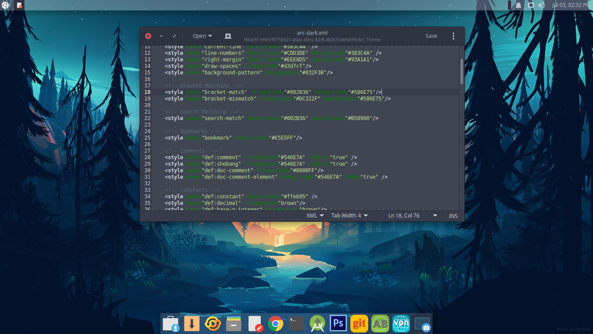
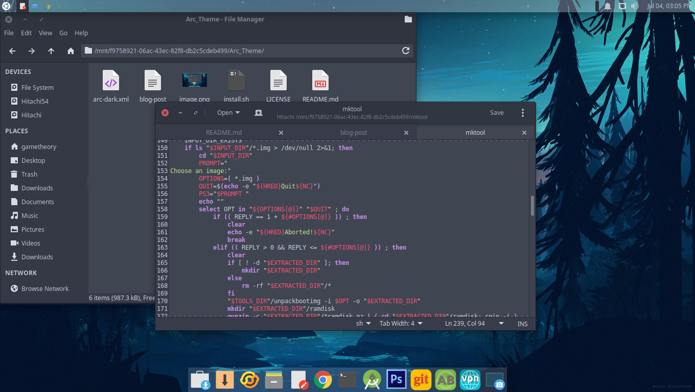

## Arc Dark Theme For Gedit & other text editors v1.0

This theme will work with gedit, pluma, or most other text editors that support themes.

## Installation

1. Make sure your text editor is closed.
2. Execute the install script as follows in a terminal: `./install.sh`
3. Now open your text editor.
4. Select the arc-dark theme from the text editor preferences.

## Alternate Installation

1. Open your text editor
2. Go to Preferences > Font & Colors
3. Click the add button
4. Now select the arc-dark theme from the location you stored it.

## Project Page

<https://techstop.github.io/arc-dark-theme-for-gedit/>

## Credits

This project is a fork of the [material theme](https://github.com/maateen/gedit-material-theme) by Maksudur Rahman Maateen, but with some improvements.
